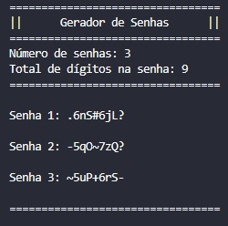

# 
 Gerador de Senhas 

Programa em Python que gera senhas aleatórias.

## Funcionamento
Ao ser executado, o programa solicita ao usuário:
* a **quantidade de senhas** que deseja gerar
* o **tamanho** que cada senha deve possuir.
> O tamanho mínimo é de 8 dígitos.

Após a inserção dessas informações, o programa faz uso de quatro listas de caracteres possíveis para gerar as senhas:

Especiais: ".", "+", "-", "@", "#", "*", "!", "?", "~";

Números: "0", "1", "2", "3", "4", "5", "6", "7", "8", "9";

Letras minúsculas: "a", "b", "c", "d", "e", "f", "g", "h", "i", "j", "k", "l", "m", "n", "o", "p", "q", "r", "s", "t", "u", "v", "w", "x", "y", "z";

Letras maiúsculas: "A", "B", "C", "D", "E", "F", "G", "H", "I", "J", "K", "L", "M", "N", "O", "P", "Q", "R", "S", "T", "U", "V", "W", "X", "Y", "Z".

O programa faz uso da biblioteca "*random*" do **Python** para escolher aleatoriamente os caracteres das senhas. As senhas geradas são armazenadas em uma lista de senhas e, em seguida, são exibidas ao usuário.

## Execução
Para executar o programa, basta executar o arquivo em um ambiente de desenvolvimento Python ou abrir o prompt de comando e executar o arquivo. 

## Limitações
Este programa é uma solução simples e limitada para gerar senhas aleatórias. É importante lembrar que senhas geradas aleatoriamente não garantem 100% de segurança, e é sempre recomendável utilizar senhas complexas e atualizá-las regularmente.

## Exemplo da saída do Terminal

